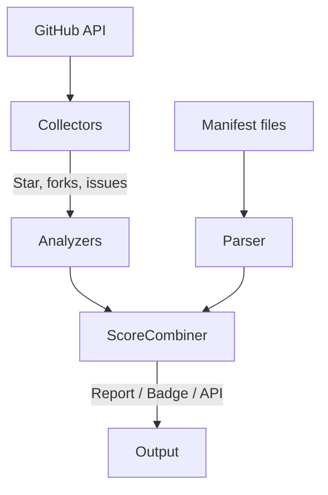

# ⭐ StarGuard: Trust Scores for GitHub Repositories

[](https://pypi.org/project/starguard/)
[](https://pypi.org/project/starguard/)


**CLI tool** to detect fake-star campaigns, dependency hijacks, licence red flags, and other signals of open-source risk.  
Inspired by the [4.5 million fake stars study](https://arxiv.org/abs/2412.13459), StarGuard helps automate open-source due diligence in seconds.

---

## 📌 Why StarGuard?

- **Fake stars are rampant.** Research shows botnets and paid campaigns artificially inflate repo popularity.
- **Supply chain attacks are rising.** Malicious packages and licence traps easily reach production.
- **Manual review doesn’t scale.** StarGuard distills key public signals into a trust score — fast, repeatable, and extensible.

---

## 🚀 Features

| Category      | What StarGuard Checks |
|---------------|------------------------|
| ⭐ **Stars**         | Burst detection (MAD + heuristics), bot-likeness profiling, Fake Star Index, trust badge generation. |
| 📦 **Dependencies**  | SBOM / manifest parsing across npm, PyPI, Maven, Go, Ruby; flags unpinned, shadow, or non-registry deps. |
| ⚖ **Licences**      | Detects unknown or high-risk licences (GPL/AGPL flags), scans both repo and direct deps. |
| 🛠 **Maintainers**   | Contributor concentration, commit cadence, inactivity warnings. |
| 🧪 **Code Signals**  | Pattern scans for obfuscation, remote exec, crypto-mining, or data exfiltration hints. |
| 📤 **Outputs**       | JSON, Markdown, plaintext reports; PNG star-history plots; shields.io badge embed. |

---

## ⚙️ How It Works

1. **GitHub API/GraphQL** – collects stars, forks, issues, traffic stats.
2. **BurstDetector** – sliding window MAD algorithm + rules to catch inorganic star spikes.
3. **User Profiler** – samples stargazers, checks account age, avatar, follower count, repo history.
4. **Dependency & Licence Parsers** – uses API or file-based fallback.
5. **Scoring Engine** – normalises components, applies weighted trust scoring + Fake-Star penalty.



---

## 🧪 Quick Start

### Requirements

- Python ≥ 3.9  
- GitHub Personal Access Token (for high-rate limits)

### Run

```bash
export GITHUB_TOKEN=ghp_xxxxxxxxx

# Full scan with star plot
python starguard.py pytorch/pytorch --format markdown --plot stars.png

# Burst-only fast scan
python starguard.py https://github.com/vercel/next.js --burst-only
```

---

## 🖥 CLI Reference

```bash
Usage: starguard OWNER/REPO [OPTIONS] 

Options:
  -t, --token TEXT                GitHub personal access token
  -f, --format [text|json|markdown]  Output format (default: text)
  -o, --output FILE                Output file (default: stdout)
  -v, --verbose                    Enable verbose DEBUG logging
  --plot FILE                      Save star history plot to specified file path
  --no-fake-stars                  Skip fake star detection (faster)
  --burst-only                     Only run burst detection (fastest)
  --help                           Show this message and exit
```
## 🔑 GitHub Token Requirements
###Token Scopes & Permissions
StarGuard works with different levels of GitHub token permissions:
### Fine-Grained Personal Access Token (Recommended)
For analyzing public repositories, you only need:

* "Read-only access to public repositories"

This minimal permission level is sufficient for most StarGuard features when analyzing public repositories.
### Classic Personal Access Token
If using a classic token, the following scopes are needed:

* repo: For repository data access (or public_repo for public repositories only)
* read:user: For analyzing user profiles (used in fake star detection)
* read:org: Optional - helpful when analyzing organization repositories

## Additional Notes

* Traffic Data: To access repository traffic data (views, clones), you must have push access to the repository
* Rate Limits: Using any token significantly increases your API rate limit (from 60 to 5,000 requests/hour)
* No Token Mode: StarGuard can run without a token, but will have reduced API limits and some features may be limited

---

## 🔍 Use-Cases

- **CTOs** – Gate open-source additions during review.
- **Security Teams** – Schedule scans, integrate with security reviews.
- **VCs** – Rapid diligence on "10k stars" developer tools.
- **Open-Source Maintainers** – Show a StarGuard badge for transparency.

---

## 🤝 Contributing

1. Fork and branch
2. Run `make test` (TBA)
3. Open a PR with small, focused commits

- Follows [Conventional Commits](https://www.conventionalcommits.org/)
- Licensed under Apache-2.0

---

## 🔒 Security & Privacy

- Only public metadata read (unless token provided)
- No code is executed; only static analysis
- Stores no personal data or credentials

---

## 📄 Licence

Apache License 2.0 © 2025 StarGuard contributors
